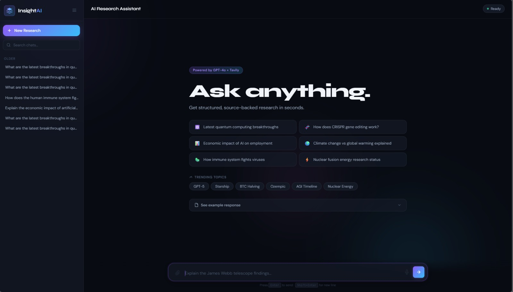
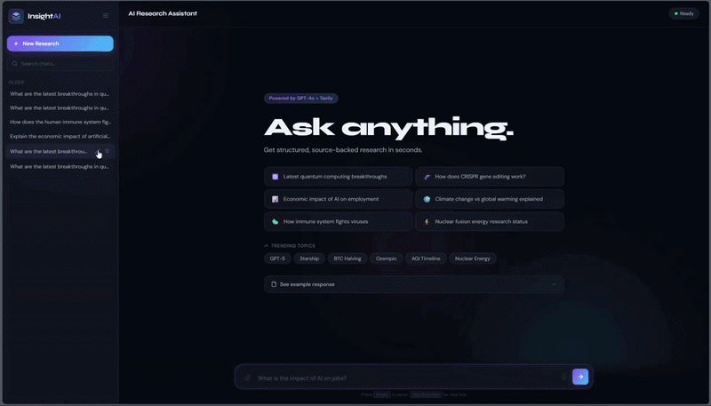
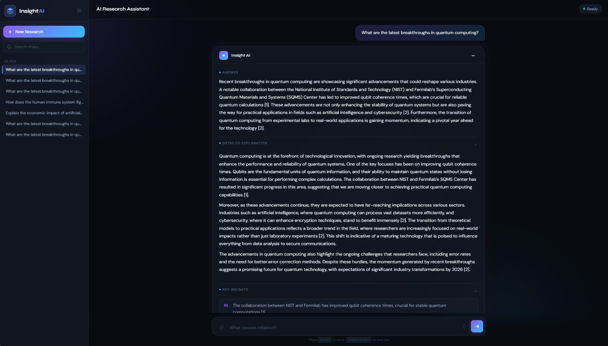
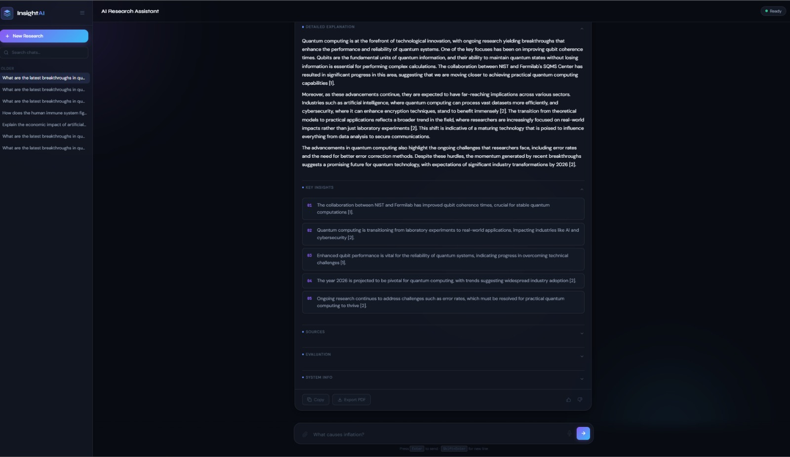

# Real-time-ai-research-engine

<div align="center">

# ⚡ Real-Time AI Research Engine

### Fault-Tolerant AI Research Assistant with Multi-Provider Retrieval, Semantic Reranking, and Real-Time Streaming

Built using FastAPI, GPT-4o-mini, Tavily, DuckDuckGo, CrossEncoder reranking, and Server-Sent Events (SSE).



</div>

---

# 🚀 Project Overview

Real-time-ai-research-engine is an advanced AI-powered research assistant designed to retrieve live information from multiple web sources, semantically rerank the retrieved content, and generate structured AI responses in real time.

Unlike traditional chatbot systems that rely heavily on static prompting or single-provider retrieval, this project focuses on building a resilient, fault-tolerant Retrieval-Augmented Generation (RAG) pipeline capable of handling:

* Retrieval instability
* Weak source relevance
* Empty API responses
* Streaming synchronization issues
* Real-time frontend rendering challenges
* Async event ordering problems

The system evolved from a simple AI chatbot into a production-style AI research engine emphasizing reliability, semantic precision, and scalable asynchronous architecture.

---

# 🧠 Core Engineering Goals

This project was built to solve real-world AI system problems rather than only focusing on UI or prompt engineering.

The major goals were:

* Build a robust retrieval pipeline
* Reduce hallucinated AI responses
* Improve source relevance using semantic reranking
* Stream responses token-by-token in real time
* Maintain frontend-backend synchronization
* Ensure graceful failure handling
* Improve user-perceived latency
* Create a scalable async architecture

---

# ⚙️ System Architecture

```text
User Query
    ↓
Query Classification
    ↓
Parallel Retrieval Layer
(Tavily + DuckDuckGo)
    ↓
Merge Results
    ↓
Deduplicate Sources
    ↓
CrossEncoder Semantic Reranking
    ↓
Context Builder
    ↓
Prompt Construction
    ↓
GPT-4o-mini Generation
    ↓
Server-Sent Events Streaming
    ↓
Frontend Rendering
```

---

# 🔥 Key Features

## ✅ Multi-Provider Retrieval System

The system integrates multiple retrieval providers:

* Tavily AI
* DuckDuckGo Instant Answer API

### Why?

Single-provider architectures frequently fail due to:

* rate limits
* empty responses
* downtime
* weak search quality

To solve this, the system performs:

* parallel asynchronous retrieval
* provider failover handling
* result merging
* deduplication

This significantly improves retrieval reliability.

---

## ✅ Semantic Reranking

Raw search results often contain:

* SEO spam
* keyword stuffing
* low-quality context
* irrelevant snippets

To solve this, the system uses:

### CrossEncoder Transformer Reranking

Model:

```python
cross-encoder/ms-marco-MiniLM-L-6-v2
```

The reranker performs deep semantic comparison between:

* user query
* retrieved content

This dramatically improves:

* grounding
* contextual relevance
* response quality

---

## ✅ Real-Time Streaming Responses

The project implements:

### Server-Sent Events (SSE)

This allows:

* token-by-token generation
* real-time frontend rendering
* reduced perceived latency
* ChatGPT-style streaming UX

Streaming architecture includes:

* async generators
* buffered event handling
* SSE synchronization
* frontend incremental rendering

---

## ✅ Structured AI Responses

The AI generates responses in a structured research format:

* Answer Summary
* Detailed Explanation
* Key Insights
* Examples
* Sources
* Evaluation Metrics
* Confidence Scores

This improves:

* readability
* research usability
* explainability

---

## ✅ Hybrid Memory System

The engine supports:

* session memory
* contextual continuity
* conversation history
* retrieval-aware prompting

This enables:

* more coherent follow-up conversations
* context-aware responses
* reduced repetition

---

## ✅ Fault-Tolerant Architecture

The project includes:

* Retry handling
* Provider fallback
* Empty response handling
* Safe streaming fallback
* Async-safe exception handling
* Cached retrievals
* Event synchronization fixes

The system was intentionally engineered to continue functioning even during partial infrastructure failures.

---

# 🧩 Major Engineering Challenges Solved

---

# 1️⃣ Retrieval Instability

## Problem

Initially the system depended only on Tavily search.

This caused:

* pipeline crashes
* empty context windows
* broken answer generation
* unreliable research results

especially when APIs:

* rate limited
* timed out
* returned empty results

---

## Solution

Implemented:

### Multi-Provider Retrieval

The system now:

* queries Tavily and DuckDuckGo concurrently
* merges results asynchronously
* deduplicates sources
* falls back automatically

Result:

* dramatically improved reliability
* lower retrieval failure rates
* more resilient RAG pipeline

---

# 2️⃣ Weak Search Relevance

## Problem

Raw web search often returned:

* noisy snippets
* unrelated pages
* SEO-heavy content
* low informational value

This confused the LLM and reduced grounding quality.

---

## Solution

Integrated:

### CrossEncoder Semantic Reranking

Instead of trusting raw search order, the system:

* computes semantic relevance scores
* reranks sources contextually
* prioritizes high-information content

Result:

* better grounding
* improved factual consistency
* cleaner prompt context

---

# 3️⃣ SSE Streaming Synchronization Issues

## Problem

The backend streamed:

* sources
* insights
* metrics

before the frontend UI containers were initialized.

This created:

* blank sections
* dropped events
* invisible source rendering
* inconsistent UI state

---

## Solution

Implemented:

### Buffered Event Handling

The frontend now:

* initializes UI containers first
* buffers pending events
* flushes events after readiness confirmation

Result:

* stable rendering
* synchronized frontend-backend flow
* reliable streaming UX

---

# 4️⃣ Empty UI Sections

## Problem

Structured sections like:

* Detailed Explanation
* Sources
* Key Insights

occasionally rendered empty during fallback scenarios.

---

## Solution

Added:

* fallback rendering logic
* parser protection
* conditional UI rendering
* safe default content

Result:

* stable structured output
* no broken cards
* cleaner frontend presentation

---

# 5️⃣ Async Event Ordering Problems

## Problem

Async retrieval + streaming created:

* race conditions
* event ordering problems
* delayed rendering
* inconsistent frontend state

---

## Solution

Implemented:

* async-safe streaming pipeline
* staged event architecture
* event synchronization checks
* controlled render ordering

Result:

* stable SSE pipeline
* improved UI consistency
* smoother user experience

---

# 💻 Tech Stack

| Category         | Technologies                              |
| ---------------- | ----------------------------------------- |
| Backend          | Python, FastAPI, AsyncIO, HTTPX           |
| AI / NLP         | OpenAI GPT-4o-mini, Sentence Transformers |
| Semantic Ranking | CrossEncoder Reranking                    |
| Retrieval        | Tavily AI, DuckDuckGo                     |
| Database         | SQLite                                    |
| Frontend         | HTML, CSS, Vanilla JavaScript             |
| Streaming        | Server-Sent Events (SSE)                  |
| ML Utilities     | Scikit-learn                              |

---

# 📂 Project Structure

```text
app/
│
├── agents/
│   ├── tavily_agent.py
│   ├── ddg_agent.py
│   ├── analysis_agent.py
│   └── base.py
│
├── engine.py
├── main.py
├── database.py
├── vector_store.py
├── hybrid_memory.py
├── reasoning_memory.py
├── session_memory.py
├── tool_memory.py
└── scorer.py

frontend/
│
├── index.html
├── scripts.js
└── style.css
```

---

# 🔍 Retrieval Pipeline

The retrieval layer follows these stages:

1. Query classification
2. Multi-provider async retrieval
3. Result merging
4. Source deduplication
5. Semantic reranking
6. Context construction
7. Prompt generation
8. Streaming inference

The pipeline was designed to optimize:

* reliability
* relevance
* responsiveness

---

# 📡 Streaming System

The project uses:

### Server-Sent Events (SSE)

Advantages:

* lightweight streaming
* lower overhead than WebSockets
* simpler architecture
* ideal for token streaming

The backend streams:

* stages
* tokens
* sources
* evaluations
* metrics

incrementally to the frontend.

---

# 🧠 Prompt Engineering Strategy

The system uses structured prompts emphasizing:

* grounding
* citation discipline
* structured formatting
* hallucination reduction
* contextual reasoning

The prompt system dynamically injects:

* reranked context
* memory snippets
* source citations

before generation.

---

# 📊 Evaluation System

The project includes response evaluation metrics:

* Relevance
* Groundedness
* Clarity
* Final Composite Score

The evaluation system combines:

* heuristic scoring
* semantic quality estimation
* grounding confidence

---

# 📈 Performance Improvements

| Feature               | Improvement                    |
| --------------------- | ------------------------------ |
| Retrieval Reliability | Multi-provider architecture    |
| Search Quality        | Semantic reranking             |
| UX Responsiveness     | SSE token streaming            |
| Fault Tolerance       | Retry + fallback handling      |
| Context Quality       | CrossEncoder filtering         |
| UI Stability          | Buffered event synchronization |

---

# 🚀 Installation Guide

## 1. Clone Repository

```bash
git clone https://github.com/RohanKaushik032/Real-time-ai-research-engine.git
cd Real-time-ai-research-engine
```

---

## 2. Create Virtual Environment

```bash
python -m venv venv
```

Activate:

### Windows

```bash
venv\Scripts\activate
```

### Linux / Mac

```bash
source venv/bin/activate
```

---

## 3. Install Dependencies

```bash
pip install -r requirements.txt
```

---

## 4. Configure Environment Variables

Create `.env`

```env
OPENAI_API_KEY=your_openai_api_key
TAVILY_API_KEY=your_tavily_api_key
```

---

## 5. Run Server

```bash
uvicorn app.main:app --reload
```

---

# 🎥 Live Demo



---

# 📸 Screenshots

## Main Interface


---

## Streaming Response UI



---

## Research Output Interface



# 🔮 Future Enhancements

Planned future improvements:

* PDF ingestion
* Vector database integration
* LangGraph orchestration
* Multi-agent workflows
* Voice interaction
* Research export system
* Authentication layer
* Persistent semantic memory
* Deployment pipeline
* Docker containerization

---

# 🌍 Real-World Applications

Potential applications include:

* Research assistants
* AI knowledge systems
* Enterprise search
* Technical copilots
* Educational AI tools
* Analyst assistants
* Intelligent documentation systems

---

# 🎯 Why This Project Matters

Most student AI projects focus only on:

* UI cloning
* prompt wrappers
* simple API integrations

This project instead focuses on:

* system reliability
* asynchronous architecture
* semantic ranking
* streaming infrastructure
* fault tolerance
* retrieval engineering

The goal was not to build another chatbot.

The goal was to engineer a more reliable real-time AI research system.

---

# 📜 License

This project is licensed under the MIT License.

---

# 👨‍💻 Author

## Rohan Kaushik

AI & Machine Learning Enthusiast

Focused on:

* Agentic AI Systems
* Retrieval-Augmented Generation (RAG)
* Semantic Search
* AI Infrastructure
* Real-Time AI Systems
* Scalable ML Architectures

---

# ⭐ Support

If you found this project useful:

* Star the repository
* Fork the project
* Contribute improvements
* Share feedback

---

<div align="center">

### Built with FastAPI, OpenAI, Semantic Search, and Real-Time Streaming

</div>
